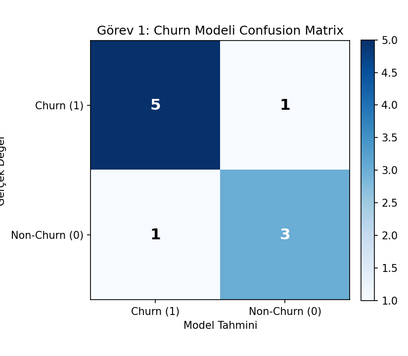
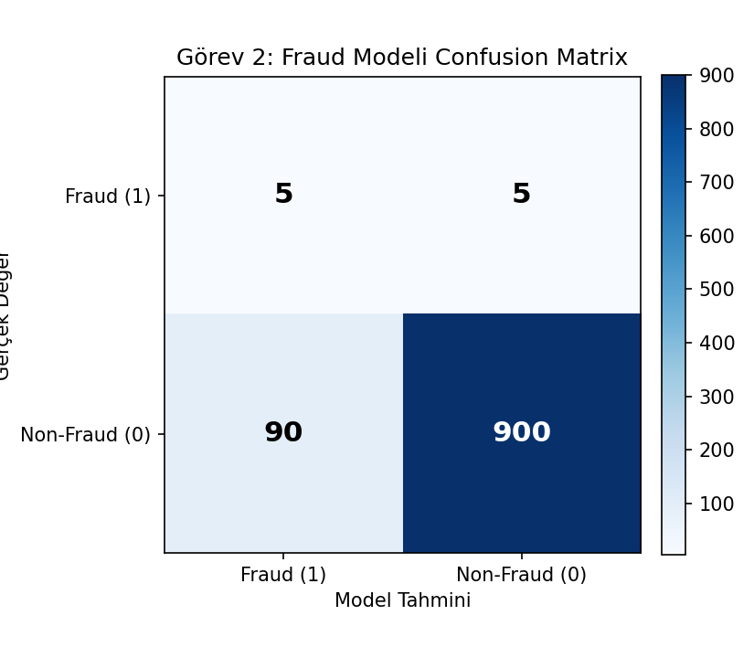

# Sınıflandırma Modeli Değerlendirme

Miuul **Data Scientist Bootcamp** kapsamında verilen "Sınıflandırma Modeli
Değerlendirme" ödevinin çözümüdür. İki ayrı görevde confusion matrix,
**Accuracy**, **Precision**, **Recall** ve **F1** skorları hesaplanmış;
ikinci görevde ayrıca bir üretim (production) vakası yorumlanmıştır.

## 📌 Görev 1 — Churn Tahmin Modeli

Müşterinin churn olup olmama durumunu tahminleyen bir sınıflandırma
modelinin 10 test gözlemi için ürettiği olasılık tahminleri verilmiştir.
Eşik değeri **0.5** alınarak confusion matrix oluşturulmuş, Accuracy,
Precision, Recall, F1 skorları hesaplanmıştır.

| Gerçek Değer | Model Olasılık Tahmini |
|:---:|:---:|
| 1 | 0.70 |
| 1 | 0.80 |
| 1 | 0.65 |
| 1 | 0.90 |
| 1 | 0.45 |
| 1 | 0.50 |
| 0 | 0.55 |
| 0 | 0.35 |
| 0 | 0.40 |
| 0 | 0.25 |

**Confusion Matrix (Eşik = 0.5):**

| | Model: Churn (1) | Model: Non-Churn (0) |
|---|:---:|:---:|
| **Gerçek: Churn (1)** | TP = 5 | FN = 1 |
| **Gerçek: Non-Churn (0)** | FP = 1 | TN = 3 |

**Sonuçlar:**

| Metrik | Değer |
|---|---:|
| Accuracy | 0.80 |
| Precision | 0.833 |
| Recall | 0.833 |
| F1 Skoru | 0.833 |



## 📌 Görev 2 — Fraud (Dolandırıcılık) Tespit Modeli

Banka işlemlerinde dolandırıcılığı yakalamak için kurulan model **%90.5
accuracy** ile "başarılı" bulunup canlıya alınmış, ancak iş birimi
canlıda modelin başarısız olduğunu bildirmiştir. Aşağıdaki confusion
matrix üzerinden metrikler hesaplanmış ve durum yorumlanmıştır.

**Verilen Confusion Matrix:**

| | Model: Fraud (1) | Model: Non-Fraud (0) | Toplam |
|---|:---:|:---:|:---:|
| **Gerçek: Fraud (1)** | 5 | 5 | 10 |
| **Gerçek: Non-Fraud (0)** | 90 | 900 | 990 |
| **Toplam** | 95 | 905 | 1000 |

**Sonuçlar:**

| Metrik | Değer |
|---|---:|
| Accuracy | 0.905 |
| Precision | 0.0526 |
| Recall | 0.50 |
| F1 Skoru | 0.0952 |



### 💡 Yorum: Veri Bilimi Ekibinin Gözden Kaçırdığı Durum

Veri seti ciddi şekilde **dengesizdir** (class imbalance): 1000 işlemin
sadece 10 tanesi (%1) gerçek dolandırıcılık vakasıdır. Böyle dengesiz bir
veri setinde **Accuracy tek başına yanıltıcıdır** — her işlemi
"Non-Fraud" olarak tahmin eden saf (naive) bir model bile %99 accuracy
elde ederdi. Ekip, modeli canlıya almadan önce yalnızca genel Accuracy'ye
(%90.5) bakmış, asıl kritik metrikleri göz ardı etmiştir:

- **Recall (%50):** Model, gerçek dolandırıcılık vakalarının sadece
  yarısını yakalayabilmektedir; 10 fraud işleminden 5'i kaçmıştır (FN).
- **Precision (%5.3):** Model "Fraud" dediğinde bu tahminin doğru çıkma
  ihtimali çok düşüktür; 95 fraud alarmından sadece 5'i gerçektir, 90'ı
  yanlış alarmdır (FP).

Sonuç olarak model hem çok sayıda gerçek dolandırıcılığı kaçırmakta hem
de iş birimini gereksiz yere çok sayıda yanlış alarmla meşgul etmektedir.
Dengesiz veri setlerinde başarı ölçütü olarak Accuracy yerine Precision,
Recall, F1 skoru (ve mümkünse iş maliyetine göre ağırlıklandırılmış
metrikler) esas alınmalıydı.

## 📁 Proje Yapısı

```
siniflandirma-modeli-degerlendirme/
├── data/
│   └── churn_test_verisi.csv          # Görev 1 test verisi
├── outputs/
│   ├── gorev1_confusion_matrix.png
│   ├── gorev1_metrikler.csv
│   ├── gorev2_confusion_matrix.png
│   └── gorev2_metrikler.csv
├── src/
│   ├── metrikler.py                   # Ortak metrik/görselleştirme fonksiyonları
│   ├── gorev1_churn_tahmini.py        # Görev 1 çözümü
│   └── gorev2_fraud_analizi.py        # Görev 2 çözümü
├── .gitignore
├── LICENSE
├── README.md
└── requirements.txt
```

## ▶️ Nasıl Çalıştırılır

```bash
git clone <repo-url>
cd siniflandirma-modeli-degerlendirme
pip install -r requirements.txt
python src/gorev1_churn_tahmini.py
python src/gorev2_fraud_analizi.py
```

Her script, sonuçları konsola yazdırır ve `outputs/` klasörüne confusion
matrix görseli ile metrik tablosunu kaydeder.

## 🧮 Kullanılan Formüller

```
Accuracy  = (TP + TN) / n
Precision = TP / (TP + FP)
Recall    = TP / (TP + FN)
F1        = 2 · Precision · Recall / (Precision + Recall)
```

## 🛠️ Kullanılan Teknolojiler

- Python 3
- pandas / numpy
- matplotlib
- scikit-learn

## 📄 Lisans

Bu proje [MIT Lisansı](LICENSE) ile lisanslanmıştır.

---
*Bu çözüm, [Miuul](https://www.miuul.com) Data Scientist Bootcamp ödev materyaline
dayanmaktadır; ödev kaynağı Miuul'a aittir, çözüm bana aittir.*
